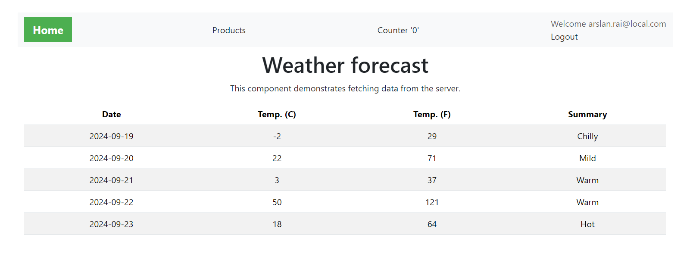

# React Redux ASP.NET API Application

This application is a POC project that combines a React frontend and an ASP.NET backend API. It is designed to serve as a playground for trying and testing new things and learning related to ASP.NET Core and React.

## Technologies Used

- **React**: A JavaScript library for building user interfaces.
- **Redux**: A predictable state container for JavaScript apps.
- **TypeScript**: A typed superset of JavaScript that compiles to plain JavaScript.
- **ASP.NET Core**: A web framework for building modern web apps and services with .NET 8.
- **ASP.NET Core Identity**: A membership system for adding user management, role management, authentication and authorization functionality and more..
- **MS SQL Server**: Powerful relational database engine.
- **Vite**: A build tool that aims to provide a faster and leaner development experience for modern web projects.
- **ESLint**: A tool for identifying and reporting on patterns found in ECMAScript/JavaScript code.
- **Docker**: A platform for developing, shipping, and running applications in containers.

## Projects

- **react_redux_aspdotnet_api.client**: Contains the React frontend code.
- **React_Redux_ASPdotNET_API.Server**: Contains the ASP.NET backend API code.

## Getting Started/Running Project

To get started with the development environment, follow these steps:

1. **Install Dependencies**: Navigate to the `react_redux_aspdotnet_api.client` directory and run `npm install`.
1. **Build the Solution**: Use build solution in Visual Studio or `dotnet build` in solution directory, if using .NET command-line tools.
1. **Run Application**: Run application in debug mode or without debugging. Don't forget to set project `React_Redux_ASPdotNET_API.Server` as start-up project in Solution Explorer.

## Features
1. **Home Page**: Shows a list of weather forecasts. Data is fetched from API on every page visit.

1. **Register User**: Provides the functionality to register a user.

1. **Login User**: Provides the functionality to login a user.

1. **Logout User**: Provides the functionality to logout a user.
1. **Product Page**: Shows a list of products. Data is fetched from API on every page visit. Only authenticated users can access this page.

1. **Add Product**: [Modal/Pop-up] Provides the functionality to create a product. Only authenticated users can access this page. Form validation is implemented.

1. **Counter Page**: Shows a counter, we can increment, decrement and reset the counter. Data is stored in Redux store and can be accessed from any page, also shown on the header (navbar). No API call is made.

## API End Points
1. **Auth**
	- `POST /api/Auth/login` - Login method for user authentication.
	- `POST /api/Auth/logout` - Logout method for user authentication, clears the authentication cookie.
	- `GET /api/Auth/test` - Test method to check if the authorization works.
	- `POST /api/Auth/refreshtoken` - Refreshes the token for the user.
1. **Products**
	- `GET /api/Products/list` - Get all products.
	- `GET /api/Products/{id}` - Get a product by ID.
	- `POST /api/Products/create` - Create a new product.
1. **User**
	- `POST /api/User/register` - Registers a new user.
	- `DELETE /api/User/{Email}` - Deletes a user.
1. **WeatherForecast**
	- `GET /WeatherForecast` - Get Weather Forecast for boilerplate.